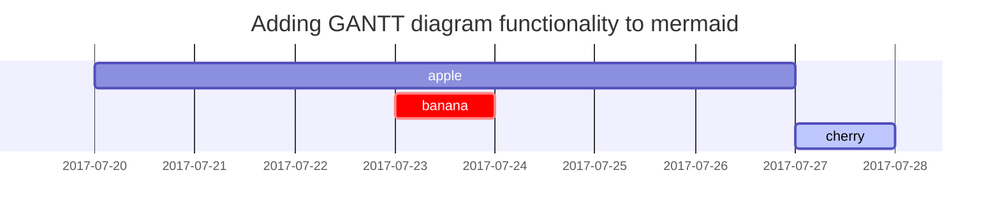

> 历时3天终于基于Github Page完成个人博客网站的搭建，现借此篇博客记录并总结一下自网站搭建以来的心路历程，相关搭建过程现已整理至[这篇博客](https://hzhang4433.github.io/posts/MacBook-&-Jekyll-&-Github-Page-&-Chirpy%E9%9D%99%E6%80%81%E5%8D%9A%E5%AE%A2%E6%90%AD%E5%BB%BA%E8%BF%87%E7%A8%8B/)中。
{: .prompt-info}

## 博客主题及其选取原因

### 需求分析
对于搭建一个个人博客网站，分析可得到自己有如下需求：
>  1. 界面简洁舒适
>  2. markdown文本及相关图片存储管理方便且安全
>  3. 网站方便管理且可拓展性强（包括功能和界面）
>  4. 博客更新操作快捷简便

### 框架与主题选择（及原因）
框架选择：`Jekyll`

选择原因：
- Github天然支持Jeklly框架的渲染
- 
- 具有丰富的主题库以供选择

主题选择：`Chirpy`

选择原因：
- 界面简洁，较符合我的审美
- 基础功能齐全，且可自定义拓展功能组件，较为灵活

## 博客页面布局及其设计思路

> 网站整体布局主要可划分为成左中右三个模块，下面分别就三个模块介绍网站页面布局与设计思路。
{: .prompt-tip }

- **左边模块**为导航栏：主要包括`首页`、`分类`、`标签`、`归档`、`关于`五个部分。
- **中间模块**为网站主体
    - 在`首页`栏下，展示文章列表，并在点击具体文章后显示文章详情信息
    - 在`分类`栏下，以文件夹的形式展示网站中的所有博客，并且支持二级目录
    - 在`标签`栏下，显示网站中存在的所有标签，并且可通过点击标签展示该标签下所有文章
    - 在`归档`栏下，以时间线的形式展示了网站中所有博客提交时间
    - 在`关于`栏下，介绍了我的本站的相关信息
- **右边模块**为辅助阅读栏：主要显示文章标签、最近更新等信息，并在进入文章详情界面时显示文章目录信息

## 博客功能实现及其技术选择

### 实现功能
- 白天/夜间模式切换
- 文章置顶
- 可配置的全局主题颜色
- 文章最后修改日期
- 文章目录及二级目录展示
- 相关文章自动推荐
- 高亮语法
- Markdown支持嵌入数学表达式和Mermaid图表
- 全站范围内的全文文本搜索

### 可拓展功能
- Atom订阅
- Disqus评论
- Google分析

### 技术栈
- GitHub Page
- GitHub Action
- ruby
- nodejs

## 博客样式设计及其美学考量

>不同与普通markdown文本语法，网站在其基础上做了一定程度的扩充，以下摘取了其中一部分内容，详细博客样式可参阅站内的这篇👉[博客](https://hzhang4433.github.io/posts/text-and-typography/)
{: .prompt-info }

### 提示框

> `tip` 类型的提示框.
{: .prompt-tip }

> `info` 类型的提示框.
{: .prompt-info }

> `warning` 类型的提示框.
{: .prompt-warning }

> `danger` 类型的提示框.
{: .prompt-danger }

### 角标

点击角标定位其具体信息角标1[^footnote], 这是另一个角标[^fn-nth-2].

### 数学公式

公式由 [**MathJax**](https://www.mathjax.org/)提供:

$$ \sum_{n=1}^\infty 1/n^2 = \frac{\pi^2}{6} $$

When $a \ne 0$, there are two solutions to $ax^2 + bx + c = 0$ and they are

$$ x = {-b \pm \sqrt{b^2-4ac} \over 2a} $$

### Mermaid图表

### 图片

- 支持白天与夜间两种模式的图片展示，点击模式切换呈现不同的图片

{: .light .w-75 .shadow .rounded-10 w='1212' h='668' }
{: .dark .w-75 .shadow .rounded-10 w='1212' h='668' }

- 支持图片浮动布局
    - 向左浮动

    {: width="972" height="589" .w-50 .left}
    Praesent maximus aliquam sapien. Sed vel neque in dolor pulvinar auctor. Maecenas pharetra, sem sit amet interdum posuere, tellus lacus eleifend magna, ac lobortis felis ipsum id sapien. Proin ornare rutrum metus, ac convallis diam volutpat sit amet. Phasellus volutpat, elit sit amet tincidunt mollis, felis mi scelerisque mauris, ut facilisis leo magna accumsan sapien. In rutrum vehicula nisl eget tempor. Nullam maximus ullamcorper libero non maximus. Integer ultricies velit id convallis varius. Praesent eu nisl eu urna finibus ultrices id nec ex. Mauris ac mattis quam. Fusce aliquam est nec sapien bibendum, vitae malesuada ligula condimentum.

    - 向右浮动

    {: width="972" height="589" .w-50 .right}
    Praesent maximus aliquam sapien. Sed vel neque in dolor pulvinar auctor. Maecenas pharetra, sem sit amet interdum posuere, tellus lacus eleifend magna, ac lobortis felis ipsum id sapien. Proin ornare rutrum metus, ac convallis diam volutpat sit amet. Phasellus volutpat, elit sit amet tincidunt mollis, felis mi scelerisque mauris, ut facilisis leo magna accumsan sapien. In rutrum vehicula nisl eget tempor. Nullam maximus ullamcorper libero non maximus. Integer ultricies velit id convallis varius. Praesent eu nisl eu urna finibus ultrices id nec ex. Mauris ac mattis quam. Fusce aliquam est nec sapien bibendum, vitae malesuada ligula condimentum.

## 博客制作过程中遇到的问题及其解决方法

> 详见站内的这篇博客👉 [MacBook & Jekyll & Github Page & Chirpy静态博客搭建过程](https://hzhang4433.github.io/posts/MacBook-&-Jekyll-&-Github-Page-&-Chirpy%E9%9D%99%E6%80%81%E5%8D%9A%E5%AE%A2%E6%90%AD%E5%BB%BA%E8%BF%87%E7%A8%8B/)
{: .prompt-tip}

[^footnote]: 角标1
[^fn-nth-2]: 角标2